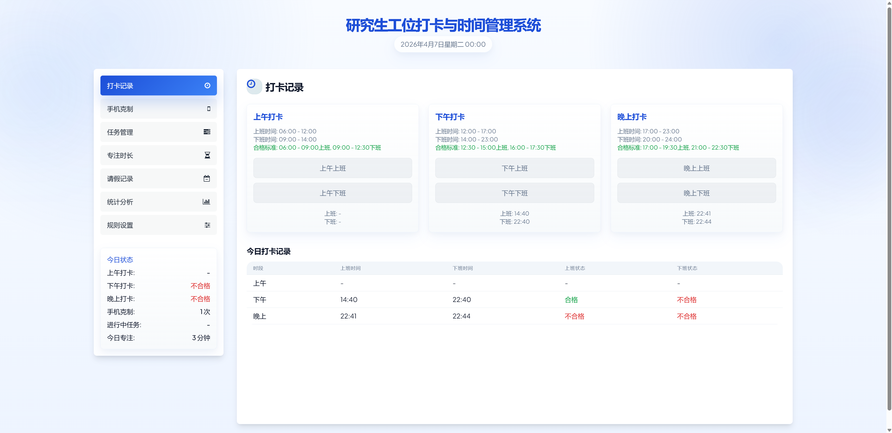

# 研究生工位打卡与时间管理系统

一个面向研究生及个人科研工作者的轻量级工位打卡与时间管理系统。

本项目是一个纯前端、单文件、零后端依赖的网页应用，适合个人本地使用。你只需要打开一个 HTML 文件，就可以完成打卡、任务管理、专注计时、久坐提醒、猫咪陪伴、请假记录、规则设置和统计分析。

## Overview

这个系统的设计目标不是做企业级考勤，而是服务于个人科研场景：

- 记录上午、下午、晚上的工位打卡
- 自定义可打卡时间窗和合格时间窗
- 跟踪手机克制、专注时长、久坐循环和任务执行情况
- 通过猫咪陪伴模块增强长期使用的反馈感
- 在本地浏览器中保存数据，无需数据库或服务器
- 通过统计图表快速查看近期执行情况

## Features

- `打卡记录`
  - 支持上午、下午、晚上三段上班/下班打卡
  - 自动判定是否合格
- `规则设置`
  - 支持配置每个时段的可打卡时间窗
  - 支持配置每个时段的合格时间窗
  - 修改后立即生效，并重算展示结果
- `专注时长`
  - 支持自定义倒计时
  - 支持专注完成提醒
  - 支持记录每日专注分钟数和场次
- `久坐提醒`
  - 支持 45 分钟坐下 + 5 分钟站立的自动循环
  - 支持开始、暂停、继续、停止与刷新恢复
  - 支持记录每日完成轮次和总站立分钟
- `猫咪陪伴`
  - 根据专注时长兑换猫粮
  - 可喂食、互动并积累好感度
  - 支持表情、爱心动画和成长式陪伴反馈
- `任务管理`
  - 支持开始/结束任务
  - 自动统计任务时长
- `手机克制`
  - 快速记录每日克制次数
  - 支持成就统计
- `请假记录`
  - 记录请假日期与原因
- `统计分析`
  - 打卡率统计
  - 时段打卡统计
  - 任务时长统计
  - 手机克制统计
  - 专注时长统计

## 界面预览

当前仓库已经预留截图展示位置。将界面截图保存到 `docs/interface-preview.png` 后，README 会直接显示。



建议后续补充这些截图：

- 打卡首页
- 猫咪陪伴与久坐提醒页
- 规则设置页
- 专注时长页
- 统计分析页

## Tech Stack

- HTML
- Tailwind CSS (CDN)
- Chart.js (CDN)
- Font Awesome (CDN)
- localStorage

## Project Structure

本项目目前采用单文件结构：

```text
.
├── 研究生工位打卡与时间管理系统.html
├── docs/
│   └── interface-preview.png
├── README.md
└── LICENSE
```

核心特点：

- 无构建工具
- 无后端
- 无数据库
- 单文件即可运行

## Quick Start

1. 克隆仓库：

```bash
git clone https://github.com/rqzhang017/Graduate-student-workstation-attendance-system.git
```

2. 进入项目目录：

```bash
cd Graduate-student-workstation-attendance-system
```

3. 直接用浏览器打开：

```text
研究生工位打卡与时间管理系统.html
```

也可以直接双击该文件运行。

## Data Storage

所有数据默认存储在浏览器的 `localStorage` 中，包括：

- 打卡记录
- 规则配置
- 专注时长记录
- 久坐提醒记录
- 任务记录
- 手机克制记录
- 请假记录
- 猫咪互动数据
- 成就数据

说明：

- 数据默认只保存在当前浏览器中
- 更换浏览器、设备或清空浏览器缓存后，数据不会自动同步

## Use Cases

这个项目适合以下场景：

- 研究生日常工位打卡
- 个人科研时间管理
- 避免久坐的实验室/工位自我提醒
- 实验室个人执行监督
- 轻量级自我约束与习惯养成

## Design Principles

- `单体应用`
  - 保持一个 HTML 文件即可运行，降低维护成本
- `本地优先`
  - 不依赖后端服务，适合个人离线使用
- `规则可调`
  - 支持按个人节奏调整打卡与合格标准
- `科研场景导向`
  - 关注工位、专注、久坐管理、任务与时间管理，而不是企业人事流程

## Roadmap

后续可以继续扩展的方向：

- 数据导出/导入
- 更多统计维度
- 主题切换
- 多人模式或实验室内部版本
- PWA 化与桌面快捷安装

## License

本项目采用 [MIT License](./LICENSE)。
