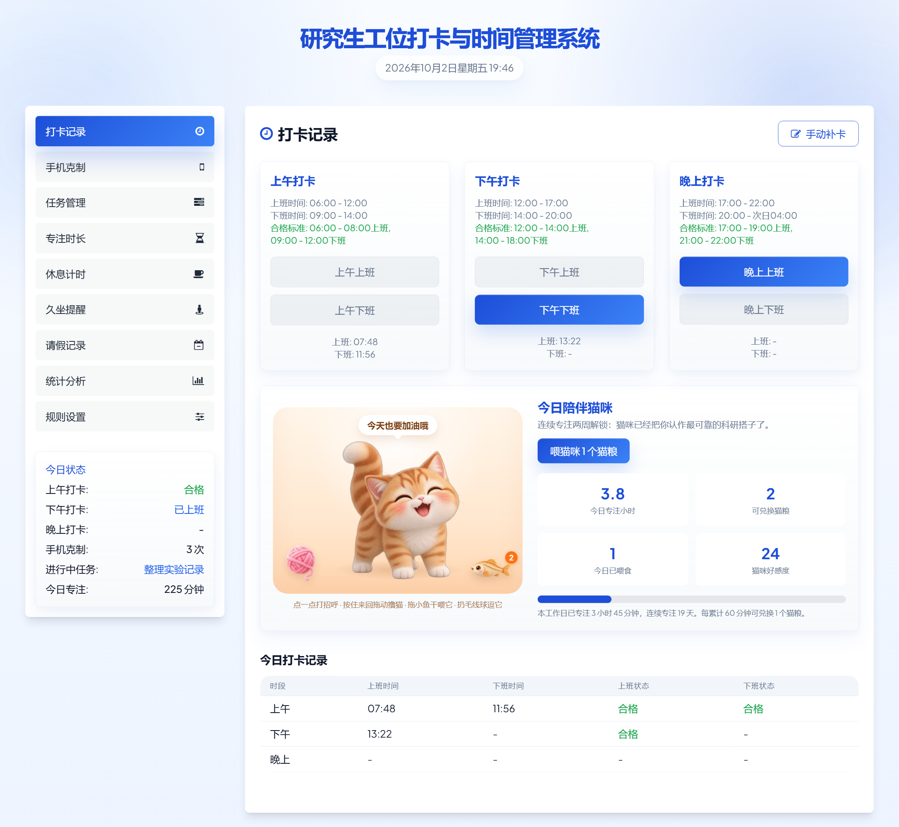
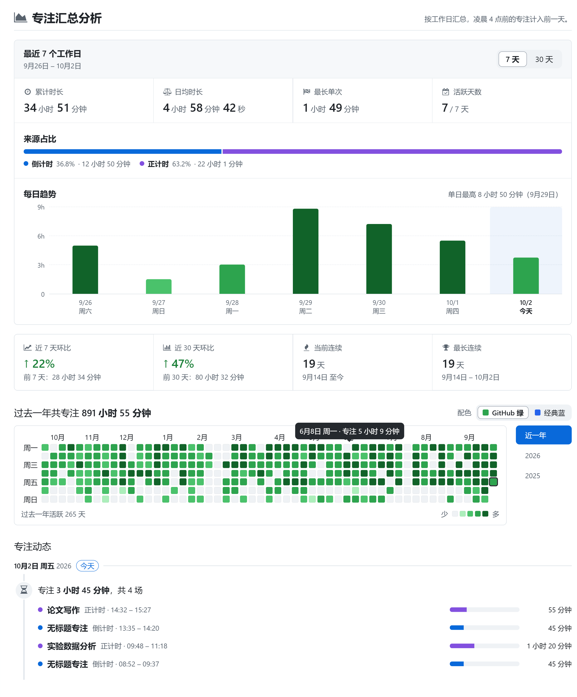

# 研究生工位打卡与时间管理系统

一个面向研究生、科研工作者和个人工位管理场景的轻量级打卡与时间管理系统。

本项目默认仍是纯前端静态应用：无需后端、无需数据库，日常使用时直接打开 HTML 文件即可。数据保存在浏览器 `localStorage` 中，适合个人本地长期使用。

同时项目已提供 Electron 桌面版入口，用于更可靠的专注完成提醒、打卡提醒、久坐提醒、系统通知、窗口置顶、任务栏闪烁和托盘后台运行。

当前版本：**v1.3.0**，各版本变化见 [更新日志](#更新日志)。

## 界面预览

打卡记录与陪伴橘猫（演示数据）：



GitHub 风格的专注汇总分析（演示数据）：



## 功能特性

- `打卡记录`：支持上午、下午、晚上三段上班/下班打卡，并自动判断是否合格。
- `手动补卡`：支持忘记打卡后补录指定工作日、时段、类型和实际时间，并按规则重新判定合格状态。
- `规则设置`：支持配置可打卡时间窗、合格时间窗和工作日翻页时刻，保存后立即重算展示。
- `专注时长`：支持倒计时与正计时双模式、可选名称、暂停/继续和补录编辑；两种模式写入同一专注账本，跨凌晨翻页的会话自动拆分到对应工作日。
- `专注分析`：GitHub 风格的专注总览，包括 7/30 天汇总、来源占比、每日趋势、环比与连续天数，以及可按年份查看、支持悬停提示和键盘切换的专注日历；点击任意一天即可查看当天的专注时间线。
- `休息计时`：支持自定义休息倒计时、暂停继续、提前结束记录和休息结束提醒。
- `猫咪陪伴`：用专注时长兑换猫粮，喂养一只原创的可交互橘猫。可以戳它、撸它、喂小鱼干、扔毛线球，它也会随专注、打卡、闲置和昼夜在 17 种姿势间切换，玩法见 [交互说明](#陪伴橘猫)。
- `久坐提醒`：支持 45 分钟坐下 + 5 分钟站立的自动循环，并保存每日站立统计。
- `任务管理`：支持任务开始/结束和任务时长统计。
- `手机克制`：快速记录克制次数，并支持成就反馈。
- `请假记录`：记录请假日期和原因，请假日会影响打卡状态。
- `统计分析`：查看打卡率、时段打卡、任务时长、手机克制和专注时长趋势。

## 交互说明

左侧导航切换各个模块。下面按模块说明可以怎么操作，以及界面会给出什么反馈。

### 陪伴橘猫

橘猫住在「打卡记录」页的猫咪舞台上，可以直接用鼠标和它玩：

| 操作 | 猫咪的反应 |
| --- | --- |
| 鼠标移到舞台上 | 转向鼠标一侧，身体跟着微微倾斜，歪头看你 |
| 点一下猫咪 | 喵一声或开心地回应，冒出小爱心 |
| 2.5 秒内连点 4 下 | 闹脾气：“不要一直戳我啦！”；连点 7 下会先吓一跳再生气 |
| 按住猫咪来回拖动 | 撸猫：眯眼打呼噜，不断冒出爱心和音符，松手后开心一下 |
| 好感度很高时持续撸 2 秒以上 | 翻肚皮撒娇 |
| 把小鱼干拖到猫咪身上 | 喂食：吃得津津有味，好感度 +1；直接点小鱼干或「喂猫咪 1 个猫粮」按钮也能喂 |
| 没有猫粮时点小鱼干 | 委屈巴巴，提醒你再专注一会儿 |
| 拖动毛线球后松手 | 按松手时的方向和速度扔出去，落地弹跳、碰壁反弹；滚到猫咪面前会被一爪拍回去，每次最多拍 3 下。直接点毛线球会把它抛向猫咪 |
| 猫咪睡着时点它，或拿起小鱼干、毛线球 | 伸个懒腰醒过来 |

不去管它时，猫咪也有自己的作息：

- 平时坐着，会随机眨眼、偶尔自言自语；还有猫粮没喂时会喵喵讨食。
- 40 秒没人理就揣手手发呆，3 分钟没有互动会睡着；22:00–6:00 舞台换成夜空，75 秒就会犯困。
- 专注计时进行中：捧着书陪你学习，不会睡着，还会时不时给你打气。
- 完成一次专注会欢呼庆祝，提前结束会劝你先休息；上班打卡时打招呼，下班打卡时送上爱心。

猫粮和好感度：

- 本工作日每累计专注 60 分钟可兑换 1 个猫粮，小鱼干上的数字就是剩余猫粮。
- 每喂一次好感度 +1。好感度和连续专注天数决定猫咪的心情；好感度达到 36 或连续专注 14 天后，撸猫时它才会翻肚皮。

### 专注计时与分析

- 顶部「倒计时 / 正计时」切换模式。已有计时进行中时再开始新的，会先询问是否结束并记录当前这段。
- 倒计时：输入 1–480 分钟，或点 3/5/10/20/45 分钟快捷按钮填入时长，再点「开始专注」；中途可「提前结束并记录」，到点后弹出「专注完成」提示。
- 正计时：名称选填，「开始正计时」后可「暂停 / 继续」，最后「结束并记录」（按扣除暂停后的实际时长记账）或「放弃不记录」，两者都会先确认。
- 本工作日专注记录：每条记录可「编辑」或「删除」；忘了计时可以点「补录记录」，填写开始、结束时间和暂停时长。删除记录不会撤销已经喂掉的猫粮和好感度。

「专注汇总分析」采用 GitHub 风格，支持以下操作：

| 操作 | 效果 |
| --- | --- |
| 点「7 天 / 30 天」 | 切换概览卡片、来源占比和每日趋势的统计范围 |
| 鼠标悬停在趋势柱或日历格子上 | 浮出当天的专注时长 |
| 点击趋势柱或日历格子 | 下方「专注动态」列出当天的专注时间线，点「回到今天」返回 |
| 点年份按钮 | 在「近一年」和各个自然年之间切换日历 |
| 用 Tab 聚焦日历后按方向键 | ↑ / ↓ 前后一天，← / → 前后一周，下方时间线同步切换 |
| 点「GitHub 绿 / 经典蓝」 | 切换日历配色，选择会被记住 |

窗口较窄时，日历可以左右滚动查看。

### 打卡、休息与其他模块

- 打卡：点对应时段的「上班 / 下班」按钮，系统按规则自动判定是否合格。
- 手动补卡：点「手动补卡」，选择工作日、时段、上班/下班和实际时间并填写原因，保存前会实时预览判定结果。补晚上下班卡时如果实际是次日凌晨，勾选弹窗里的次日选项即可记回所选工作日；要覆盖已有记录或补到请假日时会先确认。
- 规则设置：改完时间窗或工作日翻页时刻后点「保存规则并立即生效」，页面立即按新规则重算；「恢复默认规则」一键还原。
- 休息计时：输入分钟数或点 5/10/15/20/30 分钟快捷按钮，再点「开始休息」；支持「暂停 / 继续」、「提前结束并记录」（按实际休息时长记录）和「重置不记录」。
- 久坐提醒：「开始计时」后按 45 分钟坐下 + 5 分钟站立自动循环，可「暂停 / 继续」；「停止并重置」会清空当前循环，但保留今天已完成的轮次统计。
- 任务管理：输入任务名称后「开始任务」，完成时「结束任务」，时长计入今日任务列表和统计。
- 手机克制：每忍住一次就点「又忍住了一次」，达到里程碑会弹出成就。
- 请假记录：选日期、填理由后「提交请假」，列表里可以删除。
- 统计分析：「本周 / 本月 / 本年」切换统计范围。
- 浏览器版通知：在专注页或休息页点「开启桌面通知」并允许浏览器通知后，计时结束会弹出系统通知。

### 桌面版：悬浮窗、托盘与系统提醒

- 正计时悬浮窗：始终置顶，拖动顶部标题栏可以移动，位置和折叠状态都会被记住；「−」折叠成小条，「+」展开，「×」只隐藏悬浮窗、不影响计时。输入名称后按回车或点「开始」即开始正计时，之后可「暂停 / 继续 / 结束」；「打开主应用」跳到专注页。倒计时进行中时悬浮窗只显示剩余时间，操作需回到主界面。
- 全局快捷键：默认 `Ctrl+Alt+T` 显示或隐藏悬浮窗，可以在「专注时长 → 悬浮窗与桌面设置」中改成其他组合或关闭；组合被其他程序占用时会提示。
- 开机自启：默认开启，在同一面板中开关。开机自动启动时只显示悬浮窗，主窗口留在托盘。
- 托盘：单击图标打开主界面；右键菜单可以显示或隐藏悬浮窗、查看专注 / 休息 / 久坐 / 打卡提醒的状态、确认当前提醒或退出。关闭主窗口只会隐藏到托盘，彻底退出请用托盘菜单里的「退出」。
- 系统提醒：专注完成、休息结束和久坐提醒触发时，主窗口会切到对应页面、任务栏闪烁并置顶约 12 秒；打卡提醒只闪烁任务栏。通知上的按钮如下：

| 提醒 | 通知按钮 |
| --- | --- |
| 专注完成 | 打开、我知道了 |
| 休息结束 | 打开、再休息5分钟、回到学习 |
| 久坐提醒 | 打开、我知道了 |
| 打卡提醒 | 去打卡、5分钟后、忽略本次 |

## 快速开始

克隆仓库：

```bash
git clone https://github.com/rqzhang017/Graduate-student-workstation-attendance-system.git
cd Graduate-student-workstation-attendance-system
```

直接用浏览器打开：

```text
研究生工位打卡与时间管理系统.html
```

也可以直接双击该 HTML 文件运行。日常使用不需要启动服务，也不需要运行 `npm`。

## 浏览器版与桌面版

如果只是记录打卡、任务、专注和统计，可以继续直接打开 HTML 使用浏览器版。浏览器版不需要安装依赖，适合轻量本地使用。

如果你更依赖提醒可靠性，建议使用 Electron 桌面版。桌面版把专注完成、打卡和久坐提醒交给 Electron 主进程处理，并提供长期置顶的正计时悬浮窗；页面最小化或窗口被遮挡时，仍可快速开始、暂停、继续或结束正计时。

| 使用方式 | 适合场景 | 说明 |
| --- | --- | --- |
| 浏览器版 | 轻量记录、直接打开 | 双击 HTML 即可使用，提醒能力受浏览器限制 |
| 桌面版 | 长时间专注、需要强提醒 | 支持正计时悬浮窗、全局快捷键、开机自启、Win11 系统通知、托盘后台和任务栏闪烁 |

## 桌面版运行

如果需要更可靠的专注提醒，可以使用 Electron 桌面版：

```bash
npm install
npm run desktop
```

桌面版在浏览器版的基础上增加了这些提醒机制：

- 专注、休息、久坐和打卡提醒都由 Electron 主进程调度，主窗口最小化、被遮挡或隐藏到托盘时照常提醒。
- 打卡提醒按当前规则自动调度，默认在合格截止前 10 分钟提醒。
- 久坐提醒由主进程接管坐下 45 分钟和站立 5 分钟的阶段切换。
- 系统通知只在到点时弹出一次，不点击也不会连续堆叠；只有在打卡通知中选择「5分钟后」，才会在 5 分钟后再提醒一次。
- 正计时按绝对时间戳累计，主窗口隐藏到托盘后也不会少算。

悬浮窗、全局快捷键、开机自启、托盘菜单和通知按钮的用法见 [交互说明](#交互说明)。

打包 Windows 安装包：

```bash
npm run build:win
```

打包完成后会在 `dist/` 目录生成：

- `研究生工位打卡与时间管理系统 Setup x.x.x.exe`：安装版。
- `win-unpacked/`：未压缩的 Windows 应用目录，可直接运行其中的 exe。

升级时直接运行新版安装包覆盖安装即可，已有的打卡、专注和猫咪数据会保留（数据位置见 [数据存储](#数据存储)）。

如果确实需要便携版，可以单独执行：

```bash
npm run build:win:portable
```

## 项目结构

```text
.
├── 研究生工位打卡与时间管理系统.html   # 应用入口和页面骨架
├── assets/
│   ├── app.js                         # 业务逻辑与交互
│   ├── app.css                        # 已编译的本地静态样式
│   ├── focus-ledger.js                # 倒计时/正计时统一会话账本与跨工作日汇总
│   ├── orange-cat/                    # 陪伴橘猫的 17 种姿势与道具（WebP）
│   └── tailwind-input.css             # Tailwind 源样式，供后续维护时重新编译
├── electron/
│   ├── main.cjs                       # Electron 主进程、托盘和系统提醒
│   ├── preload.cjs                    # 前端与桌面能力的安全桥接
│   ├── floating.html                  # 正计时悬浮窗页面
│   ├── floating.js                    # 悬浮窗状态展示与 IPC 控制
│   └── icon.png                       # 桌面窗口和托盘图标
├── docs/
│   ├── interface-preview.png          # README 界面预览图：打卡记录与陪伴橘猫
│   ├── focus-analysis-preview.png     # README 界面预览图：专注汇总分析
│   ├── ASSETS.md                      # 素材来源与处理记录
│   ├── ROADMAP.md
│   └── CROSS_MIDNIGHT_FIX.md
├── test/                               # 统一账本与页面/IPC 契约测试
├── tools/                              # Electron 隔离冒烟与 app.asar 验证脚本
├── package.json                       # Electron 开发和打包脚本
├── package-lock.json                  # npm 依赖锁定
├── tailwind.config.cjs                # Tailwind 构建配置
├── README.md
└── LICENSE
```

## 技术说明

- `HTML + CSS + JavaScript`：纯前端静态运行。
- `localStorage`：所有数据保存在当前浏览器本地。
- `Tailwind CSS`：样式已编译到 `assets/app.css`，不再依赖运行时 Tailwind CDN。
- `Chart.js`：统计页首次打开时按需加载，避免影响普通打卡操作。
- `Font Awesome`：用于基础图标显示。
- `Electron`：可选桌面壳，用于系统级专注提醒、托盘和窗口控制。

如果后续修改 Tailwind 源样式，可重新生成 CSS（需固定使用 Tailwind CSS v3，v4 的命令行和配置方式不兼容）：

```bash
npx tailwindcss@3.4.17 -c ./tailwind.config.cjs -i ./assets/tailwind-input.css -o ./assets/app.css --minify
```

## 性能优化

当前版本已经从单 HTML 重构为静态多文件结构，并针对点击响应做了优化：

- 主要业务逻辑迁移到 `assets/app.js`，页面入口更轻。
- 样式迁移到本地静态 CSS，移除 Tailwind 运行时编译开销。
- 点击保存时优先写入主快照，旧版兼容 key 延迟到空闲时写入。
- 高频 DOM 节点使用缓存读取，减少重复查询。
- 专注、任务、久坐倒计时合并为统一秒级 tick，无计时时不运行秒级循环。
- 统计图表只在统计页可见时刷新，Chart 实例复用，不再每次销毁重建。
- 陪伴橘猫素材为 512px 透明 WebP，17 个姿势和道具合计不到 1MB；猫咪的动作循环只在打卡页可见时运行。

## 数据存储

浏览器版的数据保存在当前浏览器的 `localStorage` 中；桌面版的数据保存在 `%APPDATA%\研究生工位打卡与时间管理系统`（Electron 用户数据目录）。两者互不相通。保存的内容包括：

- 打卡记录和打卡规则
- 手动补卡时间、补卡原因和覆盖前记录
- 工作日翻页时刻
- 统一专注会话账本（倒计时、正计时、暂停区间、来源和工作日拆分）与猫咪互动数据
- 休息计时记录
- 久坐提醒记录
- 任务记录
- 手机克制记录
- 请假记录
- 成就数据

注意事项：

- 数据默认只保存在当前浏览器和当前域名/文件来源下。
- 更换浏览器、设备或清空浏览器数据后，历史记录不会自动同步。
- 当前版本保持旧版 `localStorage` key 的兼容写入，便于历史数据继续读取。
- 桌面版覆盖安装升级不会清除上述目录中的数据。
- 备份桌面版数据：先右键托盘图标退出程序，再复制整个 `%APPDATA%\研究生工位打卡与时间管理系统` 文件夹；其中 `Cache`、`Code Cache`、`GPUCache` 等缓存目录可以不复制。

## 适用场景

- 研究生日常工位打卡
- 个人科研时间管理
- 实验室工位自我约束
- 学习间隙休息提醒
- 避免久坐提醒
- 专注时间记录与习惯养成

## 设计原则

- `本地优先`：不依赖后端，数据留在本地浏览器。
- `静态可运行`：入口 HTML 可直接打开，部署到 GitHub Pages 也可运行。
- `规则可调`：打卡规则、合格规则和工作日翻页时刻都可在界面中调整。
- `科研场景导向`：关注工位、专注、久坐、任务与长期执行反馈。

## 素材说明

- 陪伴橘猫由项目作者使用 ChatGPT 图像生成创作，并按本项目的猫粮、好感度、台词和统计逻辑进行展示。
- 素材来源和处理方式见 [docs/ASSETS.md](docs/ASSETS.md)。

## 更新日志

### v1.3.0（2026-10-02）

- 猫咪陪伴全面重做：原创 3D 毛绒风橘猫，17 种姿势，外加小鱼干和毛线球两件道具。
- 新增戳、撸猫、拖拽喂食和扔毛线球等互动，猫咪会随专注、打卡、闲置和昼夜自动切换姿势，详见 [交互说明](#陪伴橘猫)。
- 移除 DockCat 素材，项目许可证改回 MIT。

### v1.2.2（2026-10-01）

- 专注汇总分析改为 GitHub 风格：概览卡片、来源占比条、带网格线的每日趋势、环比与连续天数。
- 新增按年份查看的专注日历：周一起始，带月份和星期标签、悬停提示、方向键切换，提供 GitHub 绿和经典蓝两套配色；点击某天显示当天的专注时间线。
- 「悬浮窗与桌面设置」面板改为同一风格，按钮文字不再折行。

### v1.2.1（2026-09-03）

- 倒计时与正计时写入统一专注账本，支持暂停区间、跨工作日拆分，旧数据自动迁移并在迁移前备份。
- 新增正计时模式和补录编辑，以及 Electron 正计时悬浮窗、全局快捷键和开机自启。
- 新增账本单元测试、页面与 IPC 契约测试、Electron 冒烟测试和安装包校验脚本。
- 陪伴猫咪改用 DockCat 素材，许可证随之改为 PolyForm Noncommercial 1.0.0（v1.3.0 已撤回）。

## Roadmap

- 数据导出/导入
- 更多统计维度
- PWA 化与桌面快捷安装
- 更完整的数据备份与恢复

## License

本项目采用 [MIT License](./LICENSE)。
